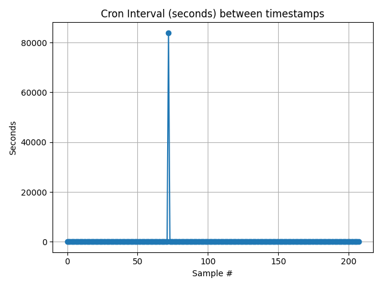

# Day 3 – Log Tools

## Files
- `parse_log.py` — reads `timestamps.log` and prints basic stats (count, min/max/avg interval).
- `plot_intervals.py` — generates `intervals.png` visualization of intervals.
- `summary.txt` — captured output from the latest run.
- `intervals.png` — latest chart.
- `.venv/` — Python virtual environment (local only).

---

## Quick Start
➡️ Run the following commands:

cd ~/controls-lab/day3-log-tools  
python3 -m venv .venv  
source .venv/bin/activate  
pip install matplotlib numpy  
python parse_log.py | tee summary.txt  
python plot_intervals.py  

---

## Example Results
📝 Output from the last run:

Latest Run (8/20/2025 @ 3:30am)  
Parsed 208 timestamps.  
Min interval: 22.00s, Max: 83897.00s, Avg: 464.74s  

---

## Chart
📊 Visualization of intervals:

